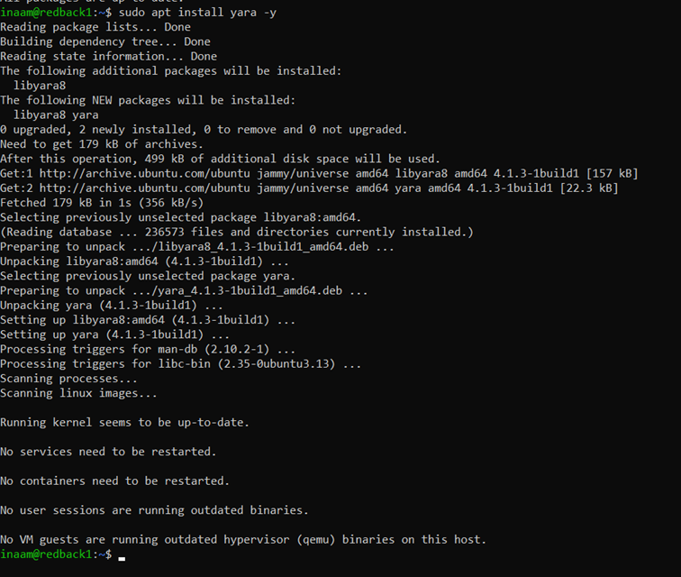
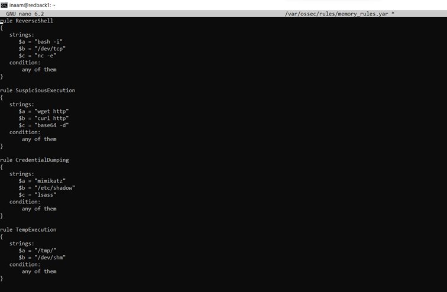
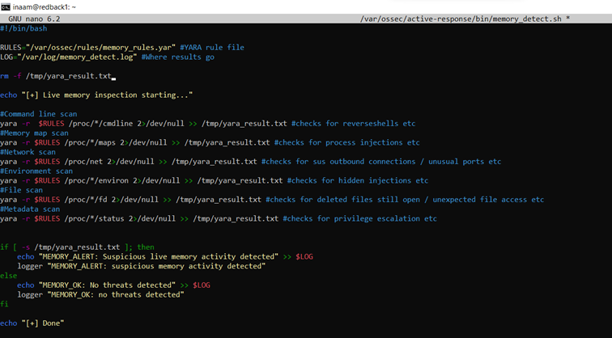
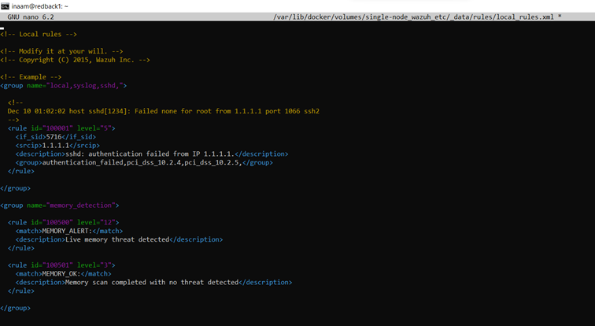
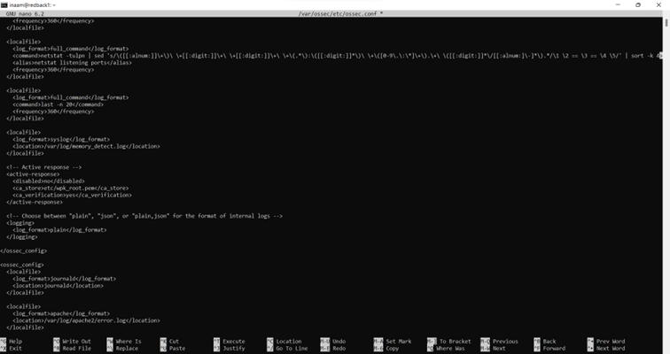
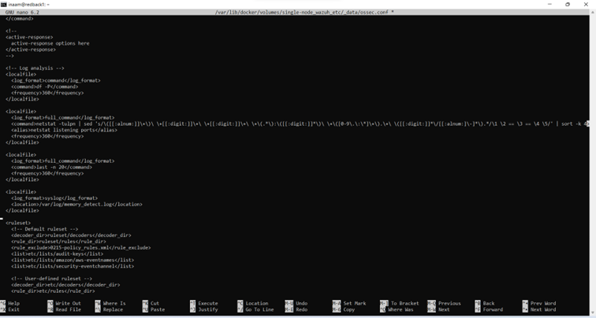
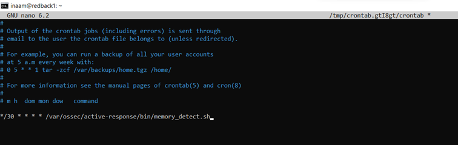

# Memory Scanner Implementation

## 1. Introduction
This document provides an overview of the memory scanner implementation that was incorporated into Redback Operation’s VM, and its integration with Wazuh. Additionally, this document covers a step by step explanation of how everything was done to help future students with how they can understand and enhance the current implementation. 

---

## 2. Background
Redback Operation’s VM was lacking a way to scan its memory for malware or suspicious activity. Several tools were explored to incorporate this, and some were even attempted with the VM but through trial and error, the final implementation was with /proc and YARA. /proc is a virtual filesystem in Linux that provides real-time information about system processes and kernel state. By using /proc we can check the live state of the RAM. YARA then is a pattern-matching and malware identification tool that uses rules to detect suspicious activity. Combined, /proc provides access to the memory’s current state and YARA can then scan for malware enabling the VM to identify potential malicious activity from the memory. 

Previously LiME and Volatility were explored for memory analysis instead, however both presented major limitations during implementation. LiME generated memory dumps that then were too large to analyse as the VM didn’t have enough space. Volatility then required kernel symbols and debug files that were unavailable or incompatible with the VM’s updated Linux kernel version. Due to these issues, the final implementation was changed to /proc and YARA which enabled rule-based detection of the live RAM without being limited due to space or other dependencies. 

---

## 3. Configuration

### 3.1 YARA Installation
YARA was installed directly on the VM:

The following YARA rules were then created:
 
These rules check for the following respectively: 
1.	Reverse shell – This looks for interactive shell backdoors. Is this process trying to turn itself into a remote command line for an attacker?
2.	Suspicious Execution – This looks for download and executions behaviour. Is something downloading code and instantly running it?
3.	Credential Dumping – This looks for credential theft indicators. Is something trying to steal passwords or authentication secrets?
4.	Temp Execution – This looks for executions from temporary locations. Is a program being run from a place that is meant to be temporary storage?

### 3.2 Script Creation
A script was then created where we can incorporate YARA with /proc to check the RAM for malicious activity:

NOTE: this script will need to be updated and enhanced, as it’s by no means an all inclusive script for malware detection.

### 3.3 Wazuh Integration
The memory scanner implementation was then integrated with Wazuh for alerts to show directly on the dashboard. First the Wazuh rules were edited to initiate the alerts on the dashboard itself:

 
Wazuh’s configuration file on the VM itself was then edited to ensure that Wazuh can read the log file:

The same was then done in the configuration file of the Wazuh Manager container:

### 3.4 Automation 
For the final step of this implementation, the script was then automated so that there wasn’t a need to manually run the script each time to check the memory. Linux cron job, which is a built-in Linux task schedular, was used for this automation. The root cron job was opened and the file was edited to run this script every 30 minutes:

---

## 4. Conclusion
A memory scanner was successfully implemented on the VM using /proc and YARA and then integrated with Wazuh. This implementation allows the VM to perform automated live memory monitoring and generate alerts for suspicious activity directly within the Wazuh dashboard. 
There are, however, some considerations for future teams. This scanner implementation is limited by the YARA rules and currently configured script and therefore cannot detect every type of malicious behavior. Future teams should continue to expand and refine these. The implementation as a whole is also limited as it cannot perform in depth forensic investigations. Enhanced tools and polished implementations should be explored as well. 
