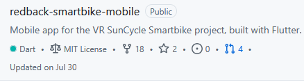
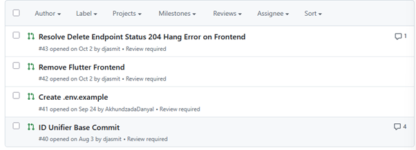

# What does Code Reviewing do?

Code reviewing is the process of looking at code that’s been created by other developers and examining it to ensure it meets company standards and requirements for secure code. This helps identity common problems that could lead to security issues such as:
- Vulnerabilities 
- Errors such as logic errors
- And inconsistencies in code

The reason the SecDevOps team reviews code is to help address these issues early, so only secure, compliant code is pushed further up the development pipeline. 

## How to access code reviews

As a member of SecDevOps you can access code reviews through the company GitHub. This can be done from the repository screen by accessing pull requests, or it can be done by looking at tasks assigned to you through GitHub’s notifications for more recent requests. 

To access them through the repository screen, simply open the pull requests using the rightmost button as seen below:

 
This will take you to all the current open requests for that repository

 
The code review process is further broken down in the next modules. 
