# Performing a Code Review
 
This section describes in detail how to perform a code review. To help ease new members into the process of reviewing code on company repositories, it will attempt to break things down in a simple, easy to follow set of steps. 

## Find open pull requests

To start reviewing code, first you need to open a repository with open pull requests. Start by looking through the company repositories to find any with open pull requests, as some of the older requests won’t show in your pull request tab. 

Take time to look over what type of code is in each repository, as some use different languages. Shown here, the Redback Senior Tech repository uses Jupyter Notebooks and currently contains 9 pull requests. 

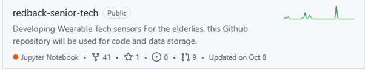
 
## Open the pull request and view initial details

After opening your chosen pull request, take some time to view the initial context and changes documented by the author of the request. These comments can provide useful information when understanding what their code is doing. 

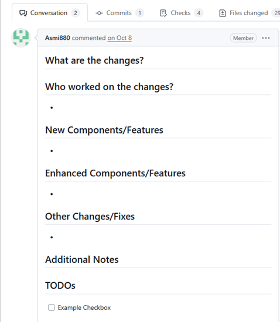
 
## View GitHub Action output

If applicable to the type of file you’re reviewing, take some time to view the output added to the conversation tab by the actions bot. For the case of python files, the Bandit security scanner can provide necessary context for whether further changes are needed to make a file compliant with the company’s security policy. 

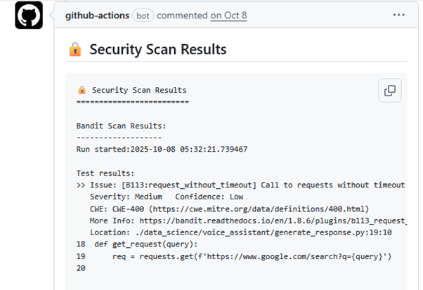
 
Take into consideration whether it’s flagged any high security or critical vulnerabilities, as well as what the scanners confidence, or the likelihood, of that vulnerability being present is. The output generally will tell you if any critical issues were found as seen in the example below. 

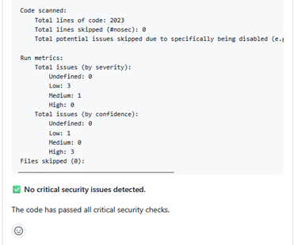
 
For any other files, make sure you view the output the actions bot shows for the general pull request checks as well. These will be covered in more detail in a later step, but it’s good to see if there are issues with the files in the pull requests.
 
As seen here, this request requires manual review and validation as the Pull Request Checks have failed. 

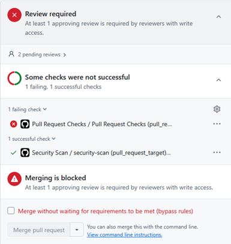
  
## View the checks tab

Once you’ve looked over the conversations tab, look through the checks tab to view any logs generated by the automated security and pull request checks, these can provide valuable information on what needs changing in the file. 

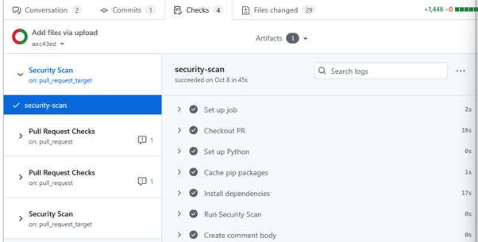
 
Viewing the logs step by step shows you the code being run against the security checks, in general this information won’t be important unless the code has failed the check. The results can be viewed in the comments posted by the GitHub-actions bot in the conversations tab as seen in the previous steps. 

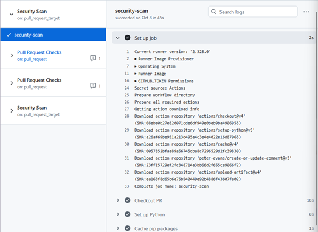

Likewise, look over any pull request checks as they show you whether the file is compliant with the companies naming conventions for files and variables. In general, it’s good practice for all files to comply with this standard, and the pull request shouldn’t be merged until these issues are resolved. 

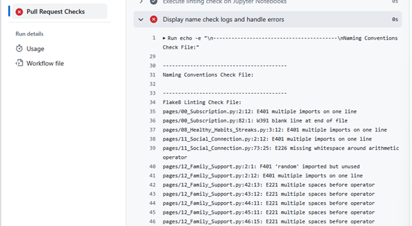
 
Sometimes if the pull request is too old, the checks can expire. In cases like this there isn’t much that can be done, so it’s best to review these older files manually and check them against the company policies on best coding practices, as well as consider any output posted by the bandit scanner in the comments section.
 
## Manually review the files

Having looked through all checks, now it’s time to view the files themselves. Looking through the file manually, it’s our job to ensure there are no major security flaws that the scanner hasn’t picked up on.

In general, we want to ensure there are no hardcoded credentials, API keys being shown, or other bad practices that may lead to security issues or potential exploits. Further information on what to look out for can be found in the Best Code Practices section of the documentation. 

At any point, if there’s a line of code you need further clarification on from the author, or if there is any potential issue you’ve flagged, add an in-line comment using the plus button and leave a question for the author of the code. 

Once you’ve finished viewing one of the files, make sure you tick the viewed checkbox to collapse the view and keep track of what files you’ve seen. 

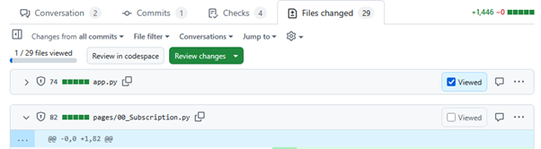
  
When you’ve finished reviewing the code, click on the button to review the changes. If the code is compliant and meets Redback Operations standards, meaning there are no critical security vulnerabilities and no compliance issues, then you may submit the approval. 

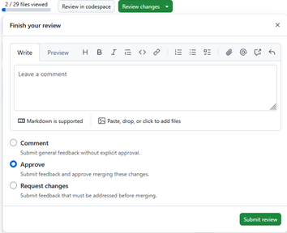
 
If you need extra context for something before deciding that you want to request changes or approve the pull request, then the comment option should be used. This allows you to submit general feedback and ask questions to get a better understanding of the authors intent. 

In any other case, if there are issues with the code such as compliancy problems the scans have found, or major security flaws such as hardcoded credentials or visible API keys, then you must request the author makes changes. Leave a comment describing what needs fixing and submit the review using the request changes option.  

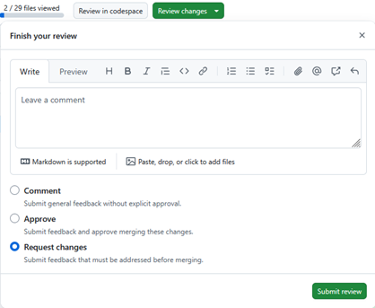 
