# The GitHub UI

This section provides guidance on how to work with the GitHub user interface. It’s intended to help new members understand how the code review process works by describing the key tabs and actions within a pull request.

## Finding pull requests

Before reviewing code, you first need to open the pull requests. Pull requests can be found either in your assigned review requests which can be found in the headers navigation menu which is highlighted below.

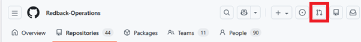

Alternatively, you can find review requests in each individual repository under that repositories pull requests. As seen in the image, there are two pull requests in the redback operations senior mobile repository.

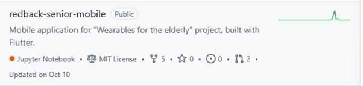

Once you have a repo opened, you can start the review process by opening any of the currently available review requests. If you need to filter to see what pull requests require reviewing, then you can apply the necessary filter from the header.

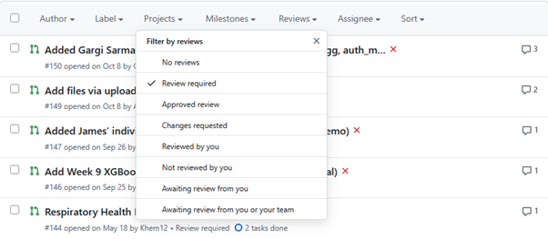

After opening a pull request, you can see all details of the chosen request. This includes the authors name, any comments left, checks made via GitHub Actions, and what the exact changes to the files were.

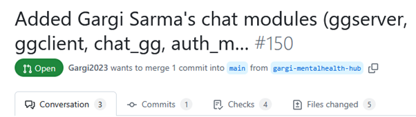
 
## Reading Comments

To start the review process, it’s recommended you read and understand any comments made by the requesting user, as this will help you understand what the changed being made are.

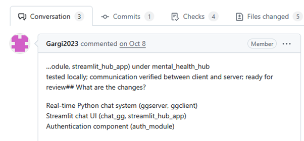

As seen in the example above, comments can be found in the conversations tab and show the full workflow of the pull request once it reaches this stage of development.

In some cases, there will be output in the comments from the GitHub-actions bot, which outputs information based on what type of file you’re reviewing. For python files, the Bandit Scanner is used to check for Common Vulnerabilities and Exposures (CVEs) that can leave the code vulnerable. This will be touched on in a later step, as it isn’t fully relevant to all code files in the redback repository.

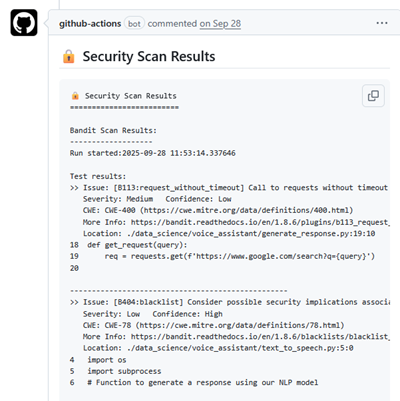

## Commits

To get an overview of what’s been changed over time, you can view the commits tab in a pull request. In here you can see all changes made in the pull request in chronological order.

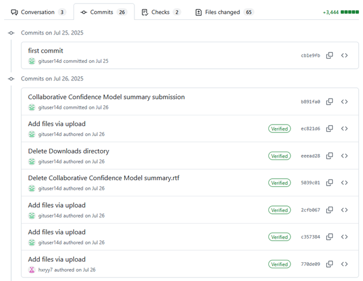

Each commit shows a set of changes made by the author at a specific point in time. Reviewing commits allows you to see how the assets in the pull request have changed over time when compared to the result.
While the commits tab isn’t a necessary feature for completing code reviews, since reviews are generally carried out in the files changed tab, it can help you:
- Understand the progression of changes
- Find when specific updates, fixes or changes were introduced

Seeing how the commits have changed over a period can provide useful context when trying to understand what issues have already been addressed during earlier iterations of the code.
 
## Checks

The checks tab is used to show the status of various integrated, automated checks, test and other verifications that run against the chosen pull request. These checks include continuous integration builds, automated tests and verification processes, security scans and other automated checks that may be included in the organisation’s development pipeline.

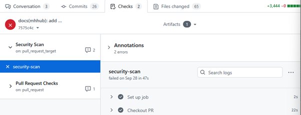

The results show whether each of the automated checks is in progress, successful, or has failed. Before a pull request can be merged to the main branch, it must pass all the chosen checks to meet Redback Operations compliance and quality standards.

When a check is successful, it simply displays a tick and moves on to the next part of the process. However, when a check fails, it will post logs as to what’s happened and will give details that can be expanded to identify what went wrong, and what must be fixed.

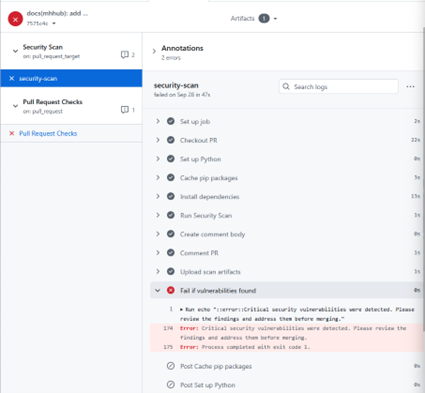 

## Files Changed

The files changed tab is one of the most important tools used in a code review by the SecDevOps team. It shows a detailed comparison between the base branch of the repository and the proposed changes in the pull request. 

As a result, this is where most of the work for code reviews happen, as it’s where we view changes made and manually review the code to find potential security or compliance issues.

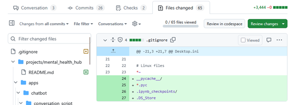

In this view, you can see exactly what was added, removed or otherwise modified from all files in the pull request. Sections of code highlighted in green show what’s been added to the file, while sections highlighted in red show what has been removed from the file.

This tab also features several useful tools you can use throughout the code review process to interact with the code, and make your job easier, these include:

The ability to comment directly on any changed line by hovering over the line and pressing the blue plus icon. This allows you to provide context on any concerning lines of code, as well as ask questions with a direct reference to what you need clarity on.

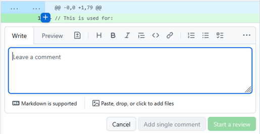

Mark files as viewed using the checkmark at the top of the file. This allows you to collapse the file, making it easier to find what you have viewed and what you still need to review. This is especially useful when working on pull requests with many files.

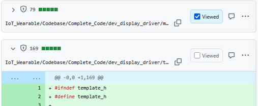

Using the settings, you can change the view type from unified to split. Unified simply shows all the changes stacked on top of the original file, while split shows them side by side with one side showing the original file state, and the other showing the changes, allowing you to more easily see what’s been changed.

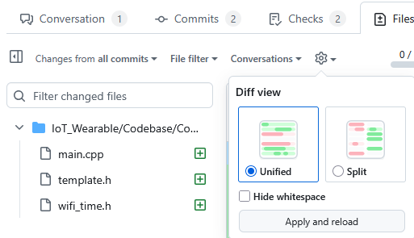

Finally, using the filter options you can filter the files by type or by certain files based on the file tree. This allows you to see all files of different types, as well as how many of that type are in the pull request.

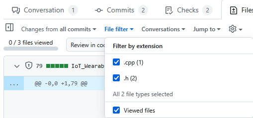

