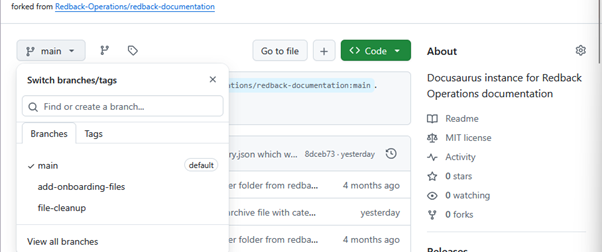
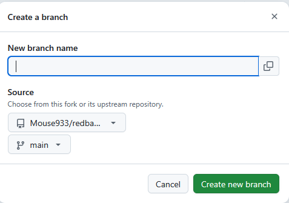
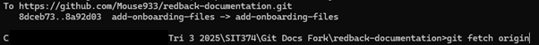
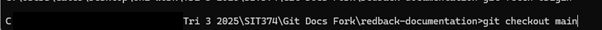
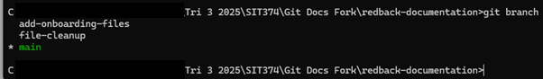

# Branching

In Git, branching refers to creating a separate working directory that allows members Redback to work on changes independently from the main codebase. This allows for users to create changes that won't directly affect the main branch of the repository. 

## How are Branches Different from Forks?

Branches and forks are both used to work on code without impacting the original repository. On the surface they may seem like they do the same thing, however, they serve a different purpose and are useful for different situations. 

As described in the previous section, forks are used to create a local namespace copy of the Redback Repository. This gives them full control over the repository where they can create changes as they see fit, before merging them back in. 

A branch however, exists within the same repository and is used by team members who already have access to the repository. Branches allow these contributors to create separate working environments where they can test changes on a repository without affecting the main branch, or any other created branches.

## How to use Branches

While the SecDevOps team mostly performs code reviews as most of their work, it’s important to know how to branch repositories when creating changes or performing maintenance.
 
To this end, we can make use of branches to perform different changes to scanners or files within different contexts. For instance, you could use one branch to delete a set of files, and another branch to add files to a different part of the repository. This ensures the work is not overlapping, and any changes are pushed separately. 

## How to Create a Branch

Branches can be created from the GitHub website. To do this, open the forked repository and click the branches drop down menu. 

 
From here, select view all branches, then new branch. 

 
Create a name for the branch, and choose what source repository and branch you want to branch off from. Once done, press the button to create a new branch. 

## How to Change Branches

Changing branches can be done from the command line. First once a new branch has been created you may need to update the local repository with all new branches using the git fetch origin command

 
Once done, the created branches will show in the output so long as this command has been run after their creation. Changing branches can be done with the git checkout command as seen in the below example. 

 
To see what branch you are on, the git branch command is used. The branch with the asterisk is the current branch.

 
