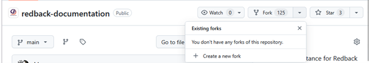
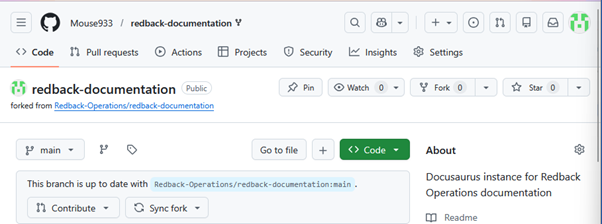
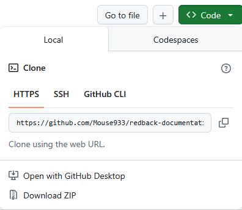
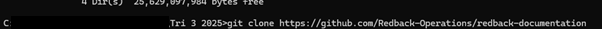

# Creating Forks 

A fork is a personal copy of a repository. Forks are used if you need to make changes to a project without modifying the original repository directly. Most users in Redback Operations will need to rely on forks to add files and propose changes to the existing files on the repositories.
 
For cases where you may need to make changes to security configurations, add new files to the repository or test updates and security fixes, forks can make it easier to work with the repository as it allows you to make changes using your preferred local environment. 

To create a fork of an existing repository, simply navigate to the repo, click the fork drop down button and create a new fork.

 
As shown here, this gives you a fork on your own local account.

## Cloning the Repository
 
Before working on the forked repository, it’s good practice to clone it to your local machine. Cloning creates a local copy of the repository on your machine allowing you to edit files, create branches and commit changes using development tools such as the git command line interface or and IDE. 

Cloning the fork is easy to do. From the forked repository click the code button as seen below and copy the URL.

 
 
Once copied you can paste the link into the Git command line tool, or your development tool of choice to clone it to your local machine using the git clone command. 

