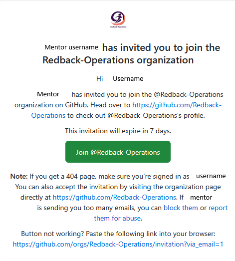

# What is GitHub?

GitHub is a cloud-based web platform used to host Git repositories. Through it, members of Redback Operations can store, manage and collaborate on their companies’ repositories.

GitHub provides users with an environment that supports:

* Version control that tracks changes made to code.
* Collaborative tools where multiple users can work on a project at the same time.
* Project management tools for detecting issues, pull requests, code reviews and merging changes.

Additionally, GitHub also provides the following features which are used in the development pipeline:

* Repositories where code and relevant files are stored for projects.
* Branching which allows for work to be carried out on different versions of a project
* Pull requests (PR) allows users to propose, review and approve code changes
* Issues which are used to track tasks, bugs and improvements.
* Actions which allow for automating workflows, as well as testing and security checks.

Redback Operations makes use of these features, with repositories for each project and team, as well as actions that automate parts of the development process or allow for security scanning on specific files.

## Why do we use GitHub?

GitHub is used across Redback Operations to store, manage and collaborate on project code across various repositories.

For SecDevOps GitHub is the main tool used by the team, allowing members to carry out code reviews, manage pull requests and ensure secure development practices are being followed. The team uses it to track code changes on all repositories, review pull requests, verify security scan results from bandit, and ensure any changes to code are compliant with security standards before changes are accepted and the code is moved further along the development pipeline.
 

## How to access the Redback GitHub repo

To access the Redback GitHub repo use the following link:

https://github.com/Redback-Operations

Without access to the SecDevOps team permissions, people who visit the site will simply have access to the public facing repositories and their files. Limited access to the sites content is allowed for visitors.

To access the tools and actions necessary for the SecDevOps team you first need to be invited to the Redback Operations Organisation as a member of the team.

Your team mentor can give you access via an email link sent to the email attached to your GitHub account, you have a limited amount of time to accept the link so make sure you do so as soon as possible.  Shown below is an example of what that invitation looks like.

Once you’re in the organisation you have access to the tools and processes used by the SecDevOps team and can view pull requests, perform code reviews and view GitHub actions.

