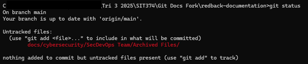
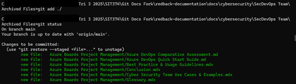
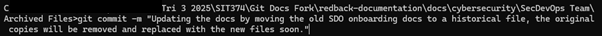
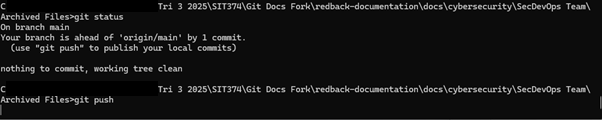
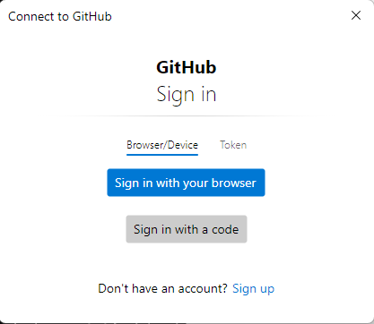
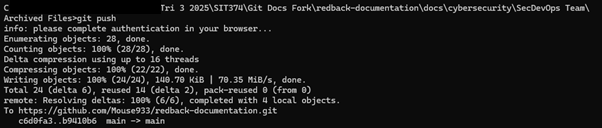
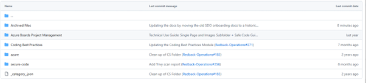

# Making Changes

This document covers how to make changes to files using the Git system. 

## Git Status

After any changes have been made to the local file system of the fork or current working branch, you can track the changes by using the git status command. 

 
As shown, this provides information on what’s been modified and what commands you can use to update the forked repository.

## Adding Changes
 
To add these changes to the repository on your namespace, you first need to use the git add command to add the changes to the next commit. Shown here, I used the git add command to add the appropriate changes to the next commit.

## Git Commit and Git Push
 
Once any changes have been added, the git commit command can be used to commit those changes to the staging area of the forked repository. When adding commits to any repository it’s good practice to add a concise message describing the work being done. To achieve this, the -m switch can be used. 

 
Running the command will push this commit to the forked repository. Running git status again will show you are one commit ahead of the main branch, or more if other commits are in the stream. The final step to adding these changes is to push the changes from the staging branch to the forked repository. This is simply done using the git push command. 

 
Once this command is run you may be asked to provide your username and password for your github account tied to the company repository. Enter these details when asked so you can push the changes to your namespace. 

## Checking the Repository
 
Once you have the correct account signed in, the changes will push to your forked repository. The info shown here will include the number of files modified, as well as what repository is being updated. 

 
Checking the forked repository shows the changes made have been added correctly.

