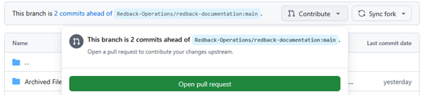
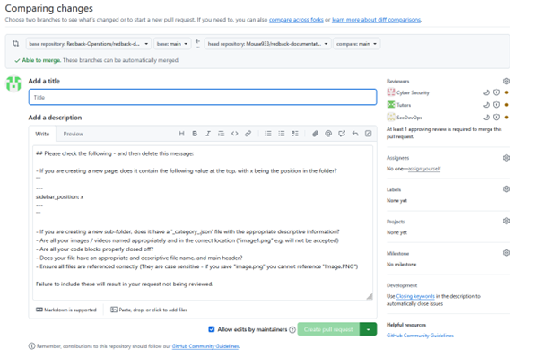
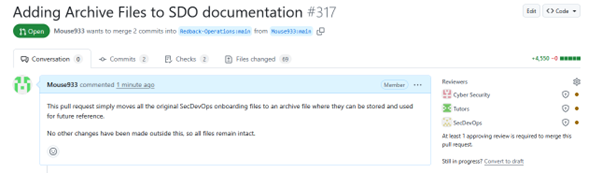

# Pull Requests

Pull requests or PRs are requests to merge the changes made in your fork into the original repository. In Redback Operations all changes to the repository must go through pull requests and be reviewed by a member of the SecDevOps team.

In general, PRs allow you to:
- explain any changes
- justify why they are needed
- have any changed files, especially code, reviewed
- allow for a manual request to have your work merged into the main project.

A pull request should only be created after your work has been forked to a local repository, cloned to your machine, and worked on in your local environment. This ensures any changes made are following the correct workflow for the organisation. A pull request should only be made when all changes and relevant commits are added to your forked repository.

When working on multiple tasks within a project, it’s good practice to submit separate pull requests with all relevant commits for each logical change. For instance, if you are performing maintenance on a scanner and refactoring the scanners file system, you should submit a pull request for any changes made to the code, and another for any changes made to the file structures.

When updating files or performing maintenance for SecDevOps tools, it’s important to ensure those changes are being updated via pull requests and reviewed by another member of the team.

## Creating Pull Requests

Creating a pull request can easily be done from the GitHub website. Navigating to your forked repository, simply click the contribute button on the header.

Opening the pull request takes you to this screen which allows you to compare changes, see what work is being moved from the forked repository to the main one, and lets you add a title to your work as well as description of what you’ve done.

 

To finalise the changes here, simply add a title and describe what the work in your pull request is doing, then click the create pull request button.

As shown here, the pull request is then opened and can be viewed by other members of the SecDevOps team. You should not perform the review on your own files, allow any reviews to be made by another member.

